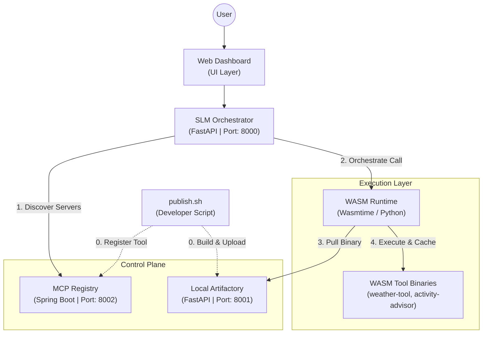

# Enterprise-Grade MCP Server Orchestrator

This project is a robust, enterprise-ready implementation of the [Model Context Protocol (MCP)](https://modelcontextprotocol.io/). It features a centralized registry, automated tool selection, a WASM-based runtime for secure tool execution, and a dynamic orchestration layer driven by Small Language Models (SLMs).

## 🏗️ Architecture Overview

The system consists of five main components interacting to provide dynamic tool discovery and execution.



## 🚀 Components

### 1. **MCP Registry** (`/mcp-registry`)
A Spring Boot application that acts as the source of truth for all available MCP servers. 
*   **Tech**: Java 21, Spring Boot, JPA, PostgreSQL.
*   **Port**: `8002`
*   **Purpose**: Manages server metadata, versioning, and configurations.

### 2. **Local Artifactory** (`/artifactory`)
A simulated binary repository for storing compiled WASM tools.
*   **Tech**: Python (FastAPI).
*   **Port**: `8001`
*   **Purpose**: Provides endpoints to upload and serve `.wasm` binaries.

### 3. **SLM Orchestrator** (`/mcp-client/slm-service`)
The "brain" of the system. It uses a Functional Model to decide which tools to call based on user queries.
*   **Tech**: Python, FastAPI, MCP SDK.
*   **Port**: `8000`
*   **Endpoint**: `/chat`

### 4. **WASM Runtime** (`/mcp-client/wasm-runtime`)
A secure, sandboxed environment for executing MCP tools.
*   **Tech**: Python, `wasmtime`.
*   **Purpose**: Dynamically loads `.wasm` binaries from Artifactory and communicates via StdIO.

### 5. **Web Dashboard** (`/mcp-client/dashboard`)
A minimalistic, responsive UI for interacting with the orchestrator.

---

## 🛠️ Getting Started

### Prerequisites
- **Java**: JDK 21+
- **Python**: 3.10+
- **Node.js**: for building tools
- **Database**: PostgreSQL (running locally)

### Installation & Setup

1.  **Start the Registry**:
    ```bash
    cd mcp-registry
    ./mvnw spring-boot:run
    ```

2.  **Start Artifactory**:
    ```bash
    cd artifactory
    source venv/bin/activate
    python main.py
    ```

3.  **Build and Publish Tools**:
    ```bash
    cd mcp-servers
    ./publish.sh
    ```
    *This script builds the JS tools to WASM, uploads them to Artifactory, and registers them in the Registry.*

4.  **Start SLM Service**:
    ```bash
    cd mcp-client/slm-service
    source venv/bin/activate
    python slm_server.py
    ```

5.  **Open Dashboard**:
    Open `mcp-client/dashboard/index.html` in your browser.

---

## 🔧 Workflow: Adding a New Tool

1.  Create a new directory in `mcp-servers/`.
2.  Implement your tool using the MCP SDK (TypeScript/JS).
3.  Add a `build` script in `package.json` to compile to WASM (using `@bytecodealliance/componentize-js`).
4.  Run `./publish.sh` to automatically register the new tool.
5.  The SLM service will automatically pick up the new tool on the next request.

## 🛡️ Security
*   **WASM Sandboxing**: Tools run in an isolated WASM environment with restricted memory and CPU.
*   **Orchestration**: Direct user input never touches the tools; it is processed by the SLM first.

---

## 📽️ Demo Highlights
*   **Zero-Config Tool Discovery**: Add a WASM file, and the LLM knows how to use it instantly.
*   **Intelligent Chaining**: Ask "Should I go for a run in Bangalore?" -> SLM fetches weather -> SLM calls activity advisor -> User gets a recommendation.
*   **YouTube Demo Link**: https://www.youtube.com/watch?v=_vD_Ka_IXz4

